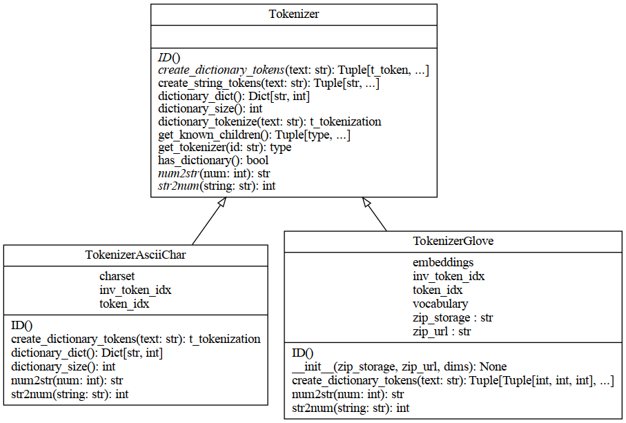

Tokenizers
==========

.. automodule:: ddp_tkn
   :members:
   :undoc-members:
   :show-inheritance:

.. toctree::
   :maxdepth: 4
   :caption: DiDip Tokenizer

.. inheritance-diagram:: ddp_tkn.Tokenizer
   :parts: 1

.. autoclass:: Tokenizer
   :members:
   :undoc-members:
   :show-inheritance:

.. inheritance-diagram:: ddp_tkn.TokenizerAsciiChar
   :parts: 1

.. autoclass:: TokenizerAsciiChar
   :members:
   :undoc-members:
   :show-inheritance:

.. inheritance-diagram:: ddp_tkn.TokenizerGlove
   :parts: 1

.. autoclass:: TokenizerGlove
   :members:
   :undoc-members:
   :show-inheritance: